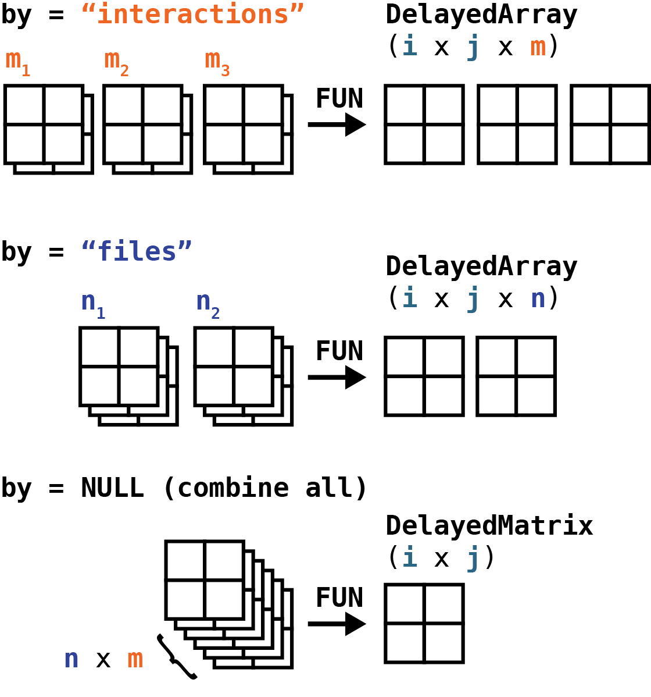

```{r, include=FALSE}
knitr::opts_chunk$set(
  collapse=TRUE,
  comment="#>"
)
```

## Overview

### Description

TODO Add description of workshop here...


### Pre-requisites

List any workshop prerequisites, for example:

* Basic knowledge of R syntax
* Familiarity with the `GenomicRanges` and `InteractionSet` classes

### Optional background reading

* Biological background
  * TODO Hi-C background
  * TODO MEGA paper
* Other _Bioconductor_ packages
  * TODO `InteractionSet`
  * TODO `DelayedArray`
  * TODO `DESeq2`
  * TODO `plotgardener`

### Participation

The format is lecture + lab, with time for data exploration.

### _R_ / _Bioconductor_ packages used

* mariner
* DESeq2
* plotgardener

### Time outline

90-minute workshop:

| Activity                            | Time |
|-------------------------------------|------|
| Overview of Hi-C data               | 10m  |
| Workshop datasets                   |  5m  |
| Differential analysis with `DESeq2` | 25m  |
| Aggregating interactions            | 25m  |
| Visualization with `plotgardener`   | 25m  |


### Workshop goals and objectives

### Learning goals

Some examples:

* Understand how to work with interaction data in R.
* Learn which `mariner` functions to use for extracting
Hi-C data.
* How to use accessors to get information from `mariner`
objects.
* Integrating `mariner` with `plotgardener` for 
programmatically visualizing genomic data.

### Learning objectives

* Conduct differential interaction analysis with `mariner` and `DESeq2`.
* Make aggregate plots with `mariner`.
* Visualize aggregate plots and genomic regions with `plotgardener`.

## Overview of Hi-C data

TODO

Topics to cover:

* Terminology (loops, anchors, pixels, resolution, diagonal)
* How to read a Hi-C map

## Workshop datasets

TODO

Topics to cover:

* Biological question (megakaryocyte differentiation)
* Hi-C files & replicate structure
* Loop & TAD files
* ATAC peaks & signal tracks

## Differential analysis with `DESeq2`

In this section we will use `DESeq2` and `mariner` to
identify differential loops between K562 cells treated
with PMA for 0 or 72 hours.

### Clustering and merging loops

The first step in this analysis is to read in and combine
loop calls for K562 cells treated for 0, 6, or 72 hours.
Due to technical and biological variability, loop callers
can identify slightly different pixels as loops in different
datasets. Sometimes this represents a true biological shift
in the position of the loop anchors, but more often is due to
noise and technical variability. Furthermore, testing these
redundant interactions reduces our power to identify true 
differences in looping.

```{r mergingFig, fig.align='center', out.width='75%', echo=FALSE}
knitr::include_graphics("img/cluster_merge.png")
```

To combat this effect, we can use `mariner` functions to 
cluster then combine loops between conditions. First, we
start by reading in BEDPE-formatted loops, and converting
them to `GInteractions` objects.

```{r message=FALSE}
library(mariner)

## Read in 3 loop files as a list of GInteractions objects
loopList <- 
  list.files("data/loops", full.names=TRUE) |>
  lapply(read.table, header=TRUE) |>
  lapply(as_ginteractions)
names(loopList) <- c("0hr", "6hr", "72hr")

## Show list of GInteractions
lapply(loopList, summary)
```
```{r}
loopList[["0hr"]]
```

Then we can use the `mergePairs()` function to cluster
then merge the list of `GInteraction` objects.

This function uses `dbscan` to cluster loops by a given
genomic `radius` in base-pairs. It selects a representative
interaction for each cluster using either the metadata
`column` provided, or if `column=NULL` it calculates new
ranges for each pair by calculating the median of modes.

```{r mergingFig2, fig.align='center', out.width='50%', echo=FALSE}
knitr::include_graphics("img/cluster_merge2.png")
```

```{r}
mergedLoops <- mergePairs(x=loopList, radius=10e3, column="APScoreAvg")
mergedLoops
```

### Exercise - Finding de novo loops

Let's take a closer look at the `MergedGInteractions` object.
This object looks and behaves as a normal `GInteractions`
object, but also contains slots storing the clustered
interactions and associated metadata. There are a few key
accessor functions that allow you to extract, aggregate, and
subset the interactions according to how they have clustered.

The input to `mergePairs()` was a list of `GInteractions` objects.
The `sources()` accessor returns the names of each input source
file:

```{r}
sources(mergedLoops)
```

Each row of the `MergedGInteractions` object represents
the selected interaction from each cluster of one or more
interactions. To view all interactions in a cluster, you
can use the `getPairClusters()` function:

```{r}
getPairClusters(mergedLoops[1500])
```

Notice that it returns a `data.table` with a column appended to the
end, `src`, indicating the source file of each interaction. All of the
metadata for each specific interaction is also included. If you want
to summarize one or more of these values for each cluster in the object,
the `aggPairMcols()` function is handy.

```{r}
aggPairMcols(x=mergedLoops, columns="APScoreAvg", funs="mean")
```

Finally, we can subset these interactions by the source file
using the `subsetBySource()` function. This function includes
optional parameters, `include` and `exclude`, which control which
sources should be grouped in the output. By default a list of
`MergedGInteractions` objects is returned for each source with
interactions that belong exclusively to that source.

```{r}
subsetBySource(x=mergedLoops) |>
  lapply(summary)
```

If we want to find loops that form _de_ _novo_ after 72 hours
explicitly excluding the 0 and 6 hour time points, we can use the
following code:

```{r}
subsetBySource(x=mergedLoops, include="72hr", exclude=c("0hr", "6hr"))
```

If we didn't care about whether the loop appeared at 6hrs or
72hrs, we can exclude the 0hr time point and the returned
object will contain loops that were called in 6hrs or 72 hrs,
but not at the 0hr time point.

```{r}
subsetBySource(x=mergedLoops, exclude="0hr")
```

*Exercise*: How could we change this code to find
transient loops, or loops that appeared after 6 hours of PMA
treatment and dissolved after 72 hours of treatment?

```{r, results='hide', eval=FALSE, echo=FALSE}
subsetBySource(x=mergedLoops, include="6hr", exclude=c("0hr", "72hr"))
```

Now let's return to our differential looping analysis to
learn how to find quantitative changes in looping.

### Finding differential loops

In the previous section, we found loops that formed
_de_ _novo_ after treatment with PMA for 0, 6, or 72
hours. Using this approach relies entirely on the loop
caller's threshold for calling loops, but is unable to
find quantitative changes - such as the strengthening
or weakening of existing loops between conditions. The
following section will allow us to find *both* _de_ _novo_
loops and those that change quantitatively.

To do this we will use `DESeq2` to conduct the
differential analysis. While `DEseq2` is typically
used for RNA-seq analysis, we find that it works very well
for finding differential Hi-C interactions. `DEseq2` requires
three pieces of information to run: 1) a count matrix where
each row represents a loop and each column represents a Hi-C
replicate sample, 2) a `data.frame` called `colData` that
contains sample-specific information, and 3) a design formula
that describes the model to test.

We can use `mariner` to create the count matrix by extracting
unnormlized contact frequency between interactions for each
Hi-C sample. First we read in the sample sheet containing
Hi-C sample information and file paths each `.hic` file:

```{r}
samples <- read.table("data/samples/samplesheet.txt", header=TRUE, colClasses="factor")
samples <- as(samples, "DataFrame")
samples
```

Since we want a count matrix with a single value for
each 5 Kb loop pixel and `.hic` file, the `pullHicPixels()`
function is what we should use with a `binSize` of 5 Kb:

```{r}
## Hi-C file paths from samplesheet
hicFiles <- as.character(samples$filepath)

## Extract pixels
pixels <- pullHicPixels(
  x=mergedLoops,
  files=hicFiles,
  binSize=5e3,
  blockSize=100e6
)
pixels
```

The object that results is called an `InteractionMatrix`
because it returns a single matrix for each interaction
and `.hic` file. You can access this matrix with the
`counts()` accessor:

```{r}
counts(pixels)
```

These counts are stored on-disk in an HDF5 file to
conserve R-memory usage. But we will talk more about
this later. For now, we have everything we need to
create a `DESeqDataSet` and run `DESeq()`.

```{r, message=FALSE}
library(DESeq2)
dds <- DESeqDataSetFromMatrix(
  countData=counts(pixels),
  colData=cbind(colData(pixels), samples),
  design=~techrep+biorep+PMAtreatment
)
dds <- DESeq(dds)
dds
```

Get shrunken results:

```{r, message=FALSE}
res <- lfcShrink(dds, coef="PMAtreatment_72hr_vs_0hr", type="apeglm")
summary(res)
```
And inspect the results with an MA plot:

```{r}
plotMA(res)
```

or a PCA plot:

```{r}
varianceStabilizingTransformation(dds) |>
  plotPCA(intgroup = "PMAtreatment") +
  ggplot2::theme(aspect.ratio = 1)
```

We can add these results from `DESeq2` to our
`InteractionMatrix` object.

```{r}
rowData(pixels) <- res
pixels
```

```{r, results='hide', eval=FALSE, echo=FALSE}
## Example of using DESeqDataSet contructor
tmp <- pixels
library(SummarizedExperiment)
colData(tmp) <- cbind(colData(tmp), samples)
counts(tmp) <- as.matrix(counts(tmp))

library(DESeq2)
DESeqDataSet(tmp, design = ~techrep + biorep + PMAtreatment)
```

## Aggregating interactions

`mariner` is not limited to extracting single pixels.
The `pullHicMatrices()` function allows you to
define square or rectangular regions and extract them
as matrices divided into specified bins. For example,
the figure below shows that supplying a `binSize` that
is half of each anchor width produces a 2x2 matrix of
pixels.

```{r matricesFigure, fig.align='center', out.width='50%', echo=FALSE}
knitr::include_graphics("img/matricesFigure.png")
```

In the following sections, we will define square regions
around our merged loop pixels and extract count matrices.
We will then aggregate these matrices and visualize the
results in what is called an Aggregate Peak Analysis (APA).
APA plots are essentially pile-up signal plots for Hi-C.
APA is helpful for identifying genome-wide trends at specific
loci, such as loop anchors or protein binding sites.

### Aggregte peak analysis of differential loops

We can use a helper function called `pixelsToMatrices()`
to expand square regions around each central pixel.

```{r pixToMat, fig.align='center', out.width='10%', echo=FALSE}
knitr::include_graphics("img/pixToMat.png")
```

```{r}
regions <- pixelsToMatrices(x=interactions(pixels), buffer=5)
regions
```

Then we can use the `pullHicMatrices()` function to extract
11 x 11 matrices by setting the `binSize` to 5 Kb:

```{r}
matrices <- pullHicMatrices(
  x=regions,
  files=hicFiles,
  binSize=5e3,
  blockSize=100e6
)
matrices
```

This results in an `InteractionArray` object that is very
similar to the `InteractionMatrix` object except that it
contains an array of pixel by Hi-C count matrices that
are accessible with the `counts()` accessor:

```{r}
counts(matrices)
```

This array contains count matrices in the first two
dimensions, interactions in the third dimension,
and Hi-C files in the fourth dimension. The data is
stored in an HDF5 file that is accessible with the
`DelayedArray` package. This allows us to use this
object as if it were held in R's memory, but only
loading data as needed (i.e. when operations are
applied to it).

We can then aggregate this array with the fast
and efficient `aggHicMatrices()` function.
This allows you to aggregate by interactions,
files, or all.

```{r aggMatFig, fig.align='center', out.width='50%', echo=FALSE}

```

Here we will combine all interactions for each
Hi-C file by setting `by="files"`:

```{r}
aggMats <- aggHicMatrices(x=matrices, by="files")
aggMats
```

*Exercise* - Try different values for the `by` argument
and see what you get!

Since the result is a `DelayedArray` object, we can
use `apply()` functions to do more complex aggregations.
Let's combine all the biological and technical replicates
for each condition (0hr or 72hr).

```{r}
ctr <- apply(aggMats[,,1:6], c(1,2), sum, na.rm=TRUE)
trt <- apply(aggMats[,,7:12], c(1,2), sum, na.rm=TRUE)
```

And visualize them with the `plotMatrix()` function:

```{r, message=FALSE, fig.show="hold", out.width="50%"}
plotMatrix(ctr)
plotMatrix(trt)
```

You'll notice that there is an artifact in the bottom
left-hand corner. This is because interactions that are
short, or close to the diagonal, are being superimposed.
The `removeShortPairs()` function can be used upstream
of `pullHicMatrices()` function to remove any interactions
that would cross the diagonal. The following code shows how
these functions can be chained to produce APA plots without
artifacts caused by the Hi-C diagonal.

```{r, message=FALSE, fig.show="hold", out.width="50%"}
## Remove short pairs & extract counts
matrices <-
  regions |>
  removeShortPairs() |>
  pullHicMatrices(files=hicFiles, binSize=5e3, blockSize=100e6)

## Aggregate by files
aggMats <- aggHicMatrices(matrices, by="files")

## Combine bio & tech replicates
ctr <- apply(aggMats[,,1:6], c(1,2), sum, na.rm=TRUE)
trt <- apply(aggMats[,,7:12], c(1,2), sum, na.rm=TRUE)

## Visualize without artifacts
plotMatrix(ctr)
plotMatrix(trt)
```

You may notice that there is not much difference
between the APA of the control vs. treatment because
we are aggregating all loops together. We can subset
the `InteractionArray` object according to our
differential looping results to show genome-wide
differences that support our analysis.

```{r, message=FALSE, fig.show="hold", out.width="25%"}
## Subset into gained/lost loops
res <- rowData(matrices)
gained <- matrices[which(res$padj <= 0.1 & res$log2FoldChange > 0)]
lost <- matrices[which(res$padj <= 0.1 & res$log2FoldChange < 0)]

## Aggregate gained/lost for control & treated
gained_ctr <- apply(counts(gained)[,,,1:6], c(1,2), sum, na.rm=TRUE)
gained_trt <- apply(counts(gained)[,,,7:12], c(1,2), sum, na.rm=TRUE)
lost_ctr <- apply(counts(lost)[,,,1:6], c(1,2), sum, na.rm=TRUE)
lost_trt <- apply(counts(lost)[,,,7:12], c(1,2), sum, na.rm=TRUE)

## Normalize to the number of interactions
gained_ctr <- gained_ctr/length(gained)
gained_trt <- gained_trt/length(gained)
lost_ctr <- lost_ctr/length(lost)
lost_trt <- lost_trt/length(lost)

## Find common scale for gained/lost
gained_scale <- c(0, max(gained_ctr, gained_trt))
lost_scale <- c(0, max(lost_ctr, lost_trt))

## Visualize
plotMatrix(gained_ctr, zrange=gained_scale)
plotMatrix(gained_trt, zrange=gained_scale)
plotMatrix(lost_ctr, zrange=lost_scale)
plotMatrix(lost_trt, zrange=lost_scale)
```

In the [final section of this workshop](vis_with_pg) we will take
these plots and visualize them on a single page with labels.

`mariner` includes the `calcApa()` function, which wraps several
of these steps together to simply your workflow. For example,
the code below can be used to accomplish the same task.

```{r, message=FALSE, fig.show="hold", out.width="25%"}
## Identify gained/lost loops
res <- rowData(pixels)
gained <- pixels[which(res$padj <= 0.1 & res$log2FoldChange > 0)]
lost <- pixels[which(res$padj <= 0.1 & res$log2FoldChange < 0)]

## Calculate apa matrices
gained_ctr <- pileupPixels(
  x=interactions(gained),
  files=hicFiles[1:6],
  binSize=5e3
)
gained_trt <- pileupPixels(
  x=interactions(gained),
  files=hicFiles[7:12],
  binSize=5e3,
  minPairDist=50e3
)
lost_ctr <- pileupPixels(
  x=interactions(lost),
  files=hicFiles[1:6],
  binSize=5e3
)
lost_trt <- pileupPixels(
  x=interactions(lost),
  files=hicFiles[7:12],
  binSize=5e3
)

## Find common scale for gained/lost
gained_scale <- c(0, max(gained_ctr, gained_trt))
lost_scale <- c(0, max(lost_ctr, lost_trt))

## Visualize
plotMatrix(gained_ctr, zrange=gained_scale)
plotMatrix(gained_trt, zrange=gained_scale)
plotMatrix(lost_ctr, zrange=lost_scale)
plotMatrix(lost_trt, zrange=lost_scale)
```

Running each step separately allows you to have the
maximum amount of control over the settings which improves
efficiency and performance. It also gives you more flexibility
to allow custom functions that haven't been explicitly created.

### Aggregate domain analysis of differential loops

In addition to pileups of pixels, we can also perform
pileup analysis for domains. In this analysis, we will
aggregate the whole domain encompassed by the differential
loops so we can visualize how the domains are changing.

We can build a helper function that makes TAD with a 
buffer on either side from the loops.

```{r}
## Write a helper function to convert
## loops into TADs
makeTadsFromLoops <- function(x) {
  d <- InteractionSet::pairdist(x, 'span')/2
  df <- data.frame(
    seqnames1(x),
    start1(x)-d,
    end2(x)+d
  )
  as_ginteractions(cbind(df, df))
}

tads <- makeTadsFromLoops(mergedLoops)
```

Then we can filter these tads for those that are gained
after 72 hours of PMA treatment.

```{r}
## Identify gained TADs
gained <- tads[which(res$padj <= 0.1 & res$log2FoldChange > 0)]
```

The `pullHicMatrices()` function can be used to 
extract count matrices for these tads at a given
resolution (in this case 5 Kb).

```{r}
## Pull TAD regions
mats <- pullHicMatrices(
  x=gained,
  files=hicFiles[7:12],
  binSize=5e3,
  blockSize=100e6
)
```

Because each region is a different size, an
irregular or jagged array object is returned:

```{r}
mats
```

The `counts()` function gives access to
these count matrices, which can be realized
with `as.list()` if needed.

```{r}
counts(mats)
```

For an aggregate TAD analysis, we need to
make these irregular arrays the same size.
The `regularize()` function resizes each
matrix to the rows and column dimensions
specified in the `ndim` parameter. The
`scale` parameter will scale each matrix
to its total signal so that each matrix
contributes the same relative signal to
the aggregation. The result is an
`InteractionArray` as we've seen in
previous sections.

```{r}
## Convert to regular array
reg <- regularize(
  x=mats,
  ndim=c(100, 100),
  nBlocks=10,
  scale=TRUE
)
```

The regularized array can then be
aggregated and visualized like before:

```{r}
## Aggregate
agg <- aggHicMatrices(reg)

## Visualize
plotMatrix(agg, zrange=c(0, 0.025))
```

We can use the wrapper function `pileupDomains()` to carry
out these steps for us:

```{r, message=FALSE, warning=FALSE, fig.show="hold", out.width="50%"}
## Identify gained TADs
gained <- tads[which(res$padj <= 0.1 & res$log2FoldChange > 0)]

## Calculate aggregate TAD plots
gained_ctr_tads <- pileupDomains(
  x=gained,
  files=hicFiles[1],
  binSize=5e3,
  buffer=0.25
)
gained_trt_tads <- pileupDomains(
  x=gained,
  files=hicFiles[7],
  binSize=5e3,
  buffer=0.25
)

## Find common scale for gained/lost
gq <- quantile(c(gained_ctr_tads, gained_trt_tads), 0.90)
gained_tad_scale <- c(0, gq)

## Visualize
plotMatrix(gained_ctr_tads, zrange=gained_tad_scale)
plotMatrix(gained_trt_tads, zrange=gained_tad_scale)
```

## Visualizing with `plotgardener` <a id="vis_with_pg" />

`plotgardener` is a genomic data visualization package for R.
It uses a coordinate-based plotting system to give users
precise control over the size and placement of visualizations.
In this section we will use `plotgardener` to programmatically
place our APA plots on a page and add text labels.

To visualize multiple plots with `plotgardener` you start by
creating a page:
```{r, echo=FALSE}
knitr::opts_knit$set(global.device = TRUE)
```

```{r, message=FALSE}
library(plotgardener)

## Create page
pageCreate(width=3, height=3)
```

We can pass additional parameters to the `plotMatrix()` function
specifying where we would like these to be placed on the page.

```{r, message=FALSE, results='hold'}
## APA plots
gainedApa <- plotMatrix(
  data=gained_ctr,
  zrange=gained_scale,
  x=0.5,
  y=0.5,
  width=0.95,
  height=0.95,
)
plotMatrix(
  data=gained_trt,
  zrange=gained_scale,
  x=0.5,
  y=1.5,
  width=0.95,
  height=0.95,
)
lostApa <- plotMatrix(
  data=lost_ctr,
  zrange=lost_scale,
  x=1.5,
  y=0.5,
  width=0.95,
  height=0.95,
)
plotMatrix(
  data=lost_trt,
  zrange=lost_scale,
  x=1.5,
  y=1.5,
  width=0.95,
  height=0.95,
)
```

We can use annotation functions to add scale legends. 

```{r message=FALSE, results='hold'}
## Plot heatmap legends
annoHeatmapLegend(
  plot=gainedApa,
  orientation='h',
  x=0.5,
  y=2.5,
  width=0.95,
  height=0.1
)
annoHeatmapLegend(
  plot=lostApa,
  orientation='h',
  x=1.5,
  y=2.5,
  width=0.95,
  height=0.1
)
```

and text labels:

```{r, message=FALSE, results='hold'}
## Plot text labels
plotText(
  label="72hr-loops",
  x=0.975,
  y=0.45,
  just=c("center", "bottom")
)
plotText(
  label="0hr-loops",
  x=1.975,
  y=0.45,
  just=c("center", "bottom")
)
plotText(
  label="0hr-hic",
  x=0.45,
  y=0.975,
  rot=90,
  just=c("center", "bottom")
)
plotText(
  label="72hr-hic",
  x=0.45,
  y=1.975,
  rot=90,
  just=c("center", "bottom")
)
```

When the plot is to your liking, you can
remove the guides on the page:

```{r, message=FALSE, results='hold'}
pageGuideHide()
```

`plotgardener` is a very useful tool for making
publication-quality genomic figures. Visit the
[website](https://phanstiellab.github.io/plotgardener/)
to learn more about what you can do with `plotgardener`.
